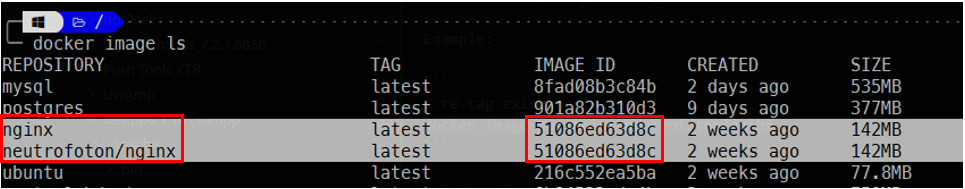

# Docker Image
> - An ***image*** is app binaries and the app's dependencies. It's an ordered collection of root filesystem changes and the corresponding execution parameters for use within a container runtime. Inside the image there is not a complete OS. No Kernel, no kernel modules (e.g: drivers). It is just binaries that our application needed, because the host provide the kernel. It is characteristic that differentiate from the VM.
> - Docker's default image "registry" is called Docker Hub (hub.docker.com)
> - Show list of sub command of ***image***<br/>
    ``` docker image
    ```
> - New Command Format is <br/>
    ``` docker image <SUB_COMMAND> (options)```


```
# Build docker image from a docker file
docker image build -t hello-docker .

# -t  => tag
# hello-docker => image name
# . => current dic of docker file.
```

```
# list image
docker image ls

# docker pull
docker image pull IMAGE_NAME

#ex: pull apache web server
docker image pull httpd

# remove docker image
docker image rm XXXXX


```


### Docker Image - Pull
```
docker image pull IMAGE_NAME:TAG

# ex:
docker image pull codewithmosh/hello-docker # deafult will pull latest tag
docker image pull ubuntu

```

### Docker Image - Tag and Push to Docker Hub

Docker image information format: <br/>

```
{user}/{repo}:{tag}
```

```
docker image tag --help

```
Usage:  <br/>
<code>docker image tag ***SOURCE_IMAGE[:TAG]*** ***TARGET_IMAGE[:TAG]***</code>
<br/>
If we don't specify the tag, the default will be **latest**
<p></p>
Example:

```
# re-tag existing image
docker image tag nginx neutrofoton/nginx
```


<br/>

To push to docker hub
```
# push to image hub
docker image push neutrofoton/nginx
```

### Docker Image - History
> - Images are made up of file system changes and metadata
> - Each layer is uniquely identified and only stored once on a host
> - This saves storage space on host and transfer time in push/pull
> - A container is just a single read/write layer on top of image

```
# Showing docker image history
docker image history IMAGE_NAME
docker image history IMAGE_NAME:TAG
```