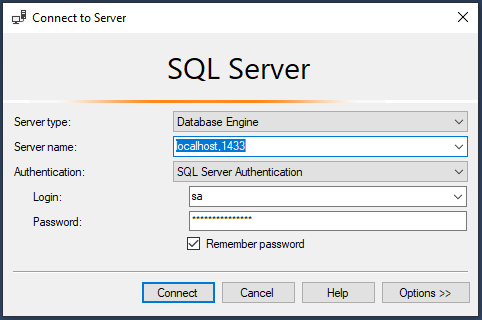

1. Create sql server container

    ```
    docker run -e "ACCEPT_EULA=Y" -e "SA_PASSWORD=P@ssw0rd.1" -p 1433:1433 --name sql2022 -d mcr.microsoft.com/mssql/server:2022-latest
    ```

2. Check the running container

    ``` bash
    docker ps -a
    ```

3. Connect to the database though SSMS.
   